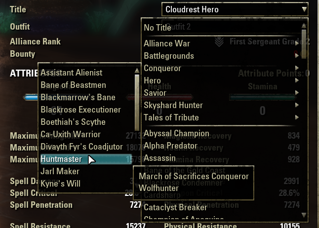

# Improved Titleizer

The purpose of this plugin is to categorize and alphabetize the Title list on the Character screen.

Sort Options:
- Alphabetically
- DLC and Alphabetically

Sample categories:
- Alliance War
- Arena
- Battlegrounds
- Dungeon
- Holiday Event
- Housing
- Questing
- Skills
- Skyshards
- Tales of Tribute
- Trials

Required Pre-requisite Addon:
LibCustomMenu
LibScrollableMenu

GitHub: https://github.com/tomstock1337/eso-ImprovedTitleizer